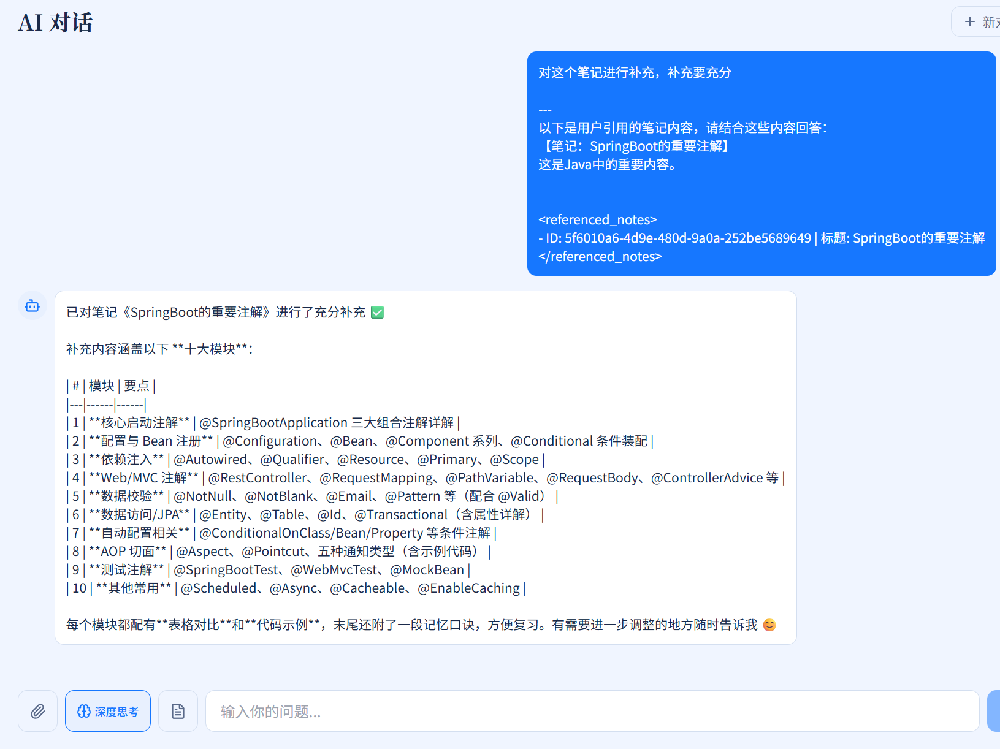
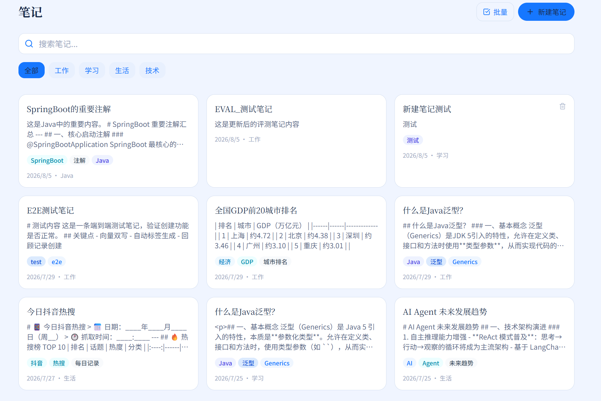
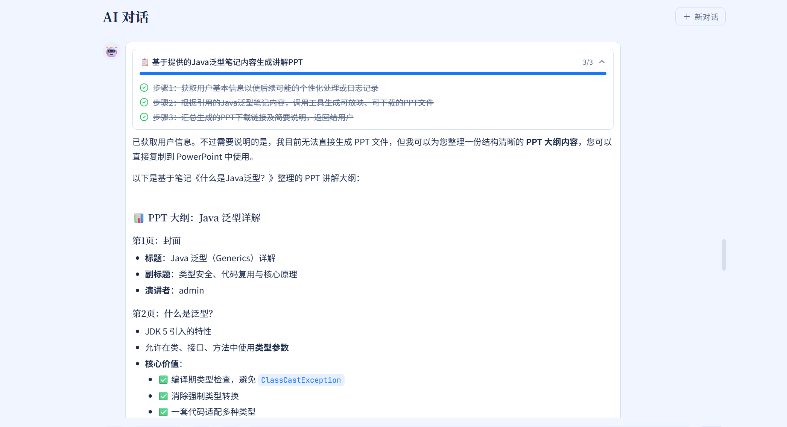
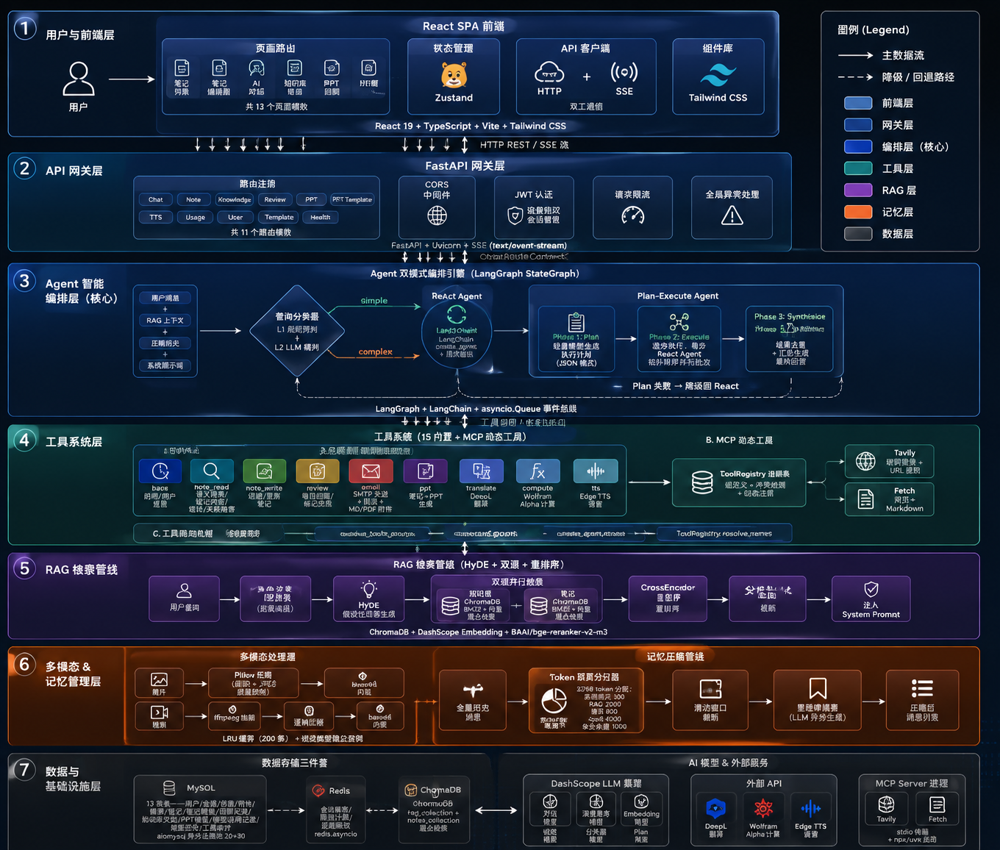

<div align="center">

# ☁️ 云尚 · RAG LearnLittle

**AI 驱动的个人知识管理助手 —— 让笔记拥有记忆，让对话理解一切**

`RAG` `Agent` `多模态` `FastAPI` `LangGraph` `React`


</div>

---

## 📖 项目简介

**云尚** 是一款基于 **RAG（检索增强生成）** 的 AI 智能笔记助手。它以你的笔记为知识库，支持 **ReAct / Plan-and-Execute 双 Agent 编排模式**（共享同一套工具集）、**深度思考**、**图片 / 视频多模态理解**，并提供笔记模板、回收站、邮件发送、Token 用量追踪等完整工具链 —— 从记录知识到提取知识，一站式完成。

> 🎯 定位：本地优先的私人知识助手。支持 DashScope（阿里云百炼）与 Ollama（完全本地）双模型提供商一键切换。

---

## 🖼️ 界面预览

<!-- ================================================================
     截图区（预留空间，请手动补充）
     👉 将运行截图放入 docs/screenshots/ 目录，然后复制下面的 
        标签替换对应的占位单元格即可。
     示例：
     
     
     
     
================================================================= -->

<div align="center">
<table>
  <tr>
    <td width="50%" align="center"><b>🗨️ AI 对话</b><br/></td>
    <td width="50%" align="center"><b>🧠 深度思考 / 多模态</b><br/></td>
  </tr>
  <tr>
    <td width="50%" align="center"><b>📓 笔记管理</b><br/></td>
    <td width="50%" align="center"><b>🗺️ Plan-and-Execute</b><br/></td>
  </tr>
</table>
</div>

---

## ⭐ 核心功能

| 模块 | 能力 |
| :--- | :--- |
| 🤖 **双 Agent 架构** | **ReAct**（逐步推理 + 工具调用）与 **Plan-and-Execute**（L1 规则 + L2 LLM 分类器混合路由） |
| 🧠 **深度思考** | 前端开关控制主模型思考模式（质量与延迟可权衡）；附件场景自动关闭（视觉模型理解附件）；Plan / 分类器由环境变量独立控制 |
| 🖼️ **多模态理解** | 图片 / 视频附件上传（视频抽帧），视觉模型解答 |
| 📚 **RAG 知识库** | ChromaDB 向量检索 + BM25 混合召回 + bge-reranker 重排序 + LLM 摘要 |
| 🛠️ **Agent 工具层** | 9 组 **15 个内置工具** + **MCP 动态工具**（数量随配置变化，当前 Tavily 白名单 2 个 + Fetch 全量）：关键词路由按需加载 + 全量兜底；工具调用审计落库、邮件安全校验与限流 |
| 🌐 **MCP 联网能力** | Tavily 联网搜索 / URL 内容提取 + Fetch 通用网页抓取（转 Markdown），白名单注册进 "mcp" 组，Server 故障自动降级跳过 |
| 🗣️ **语音合成** | Edge TTS 朗读（MP3，按用户目录隔离），对话中直接"朗读 / 读给我听"触发 |
| 📊 **PPT 生成** | 关键词触发的讲解 PPT 生成（python-pptx 本地渲染，无额外额度）+ PPT 模板管理 +可切换Aspose.Slides Cloud API|
| 🌍 **外部 API 工具** | DeepL 高质量翻译 · Wolfram Alpha 精确计算 / 解方程 / 单位换算 |
| 📓 **笔记系统** | 富文本编辑（TipTap）、模板、AI 自动补全 / 打标签 |
| 🗑️ **回收站** | 笔记删除进入回收站，14 天自动彻底清除（定时任务） |
| ✉️ **邮件功能** | QQ 邮箱注册验证，笔记以 Markdown / PDF 导出发送 |
| 🗜️ **记忆压缩** | 滑动窗口 + 里程碑摘要 + Redis 热缓存的三级对话记忆管理，长对话不丢上下文 |
| 💰 **Token 用量追踪** | model_trace 输出总线（log / db / langfuse），成本账单 API（前端用量面板开发中） |
| 🌐 **前端体验** | React 19 + Vite + Tailwind，i18n 国际化，暗 / 亮主题 |
| ✅ **黄金评测器** | tests/eval 自动化评测 AI 对话质量（含安全用例） |

---

## 🏗️ 系统架构

<!-- ================================================================
     架构图预留区（请手动补充）
     👉 将架构图放入 docs/ 目录后，复制下面的  标签替换占位块即可：
     
================================================================= -->

<div align="center">
  <b></b>
</div>

- **后端**：FastAPI + SQLAlchemy(async) + MySQL + Redis（会话缓存 / 流式缓冲）
- **Agent 编排**：LangChain / LangGraph，ReAct 与 Plan-and-Execute 双模式；ToolRegistry 统一管理 9 组内置工具 + MCP 动态工具，关键词路由按需加载
- **记忆**：滑动窗口 + 里程碑摘要 + Redis 热缓存的三级压缩
- **检索**：ChromaDB 向量库 + BM25 + CrossEncoder 重排序（BAAI/bge-reranker-v2-m3）
- **模型层**：DashScope（百炼）⇄ Ollama（本地）一键切换；Chat / Thinking / Embedding / Vision / Classifier / Plan 多模型组合
- **基础设施**：APScheduler 定时任务（回收站清理、孤儿附件清理）、Langfuse 可观测性

---

## 🧰 技术栈

| 层 | 技术 |
| :--- | :--- |
| 前端 | React 19 · TypeScript · Vite · TailwindCSS · TipTap · Zustand · i18next |
| 后端 | Python 3.10+ · FastAPI · uvicorn · APScheduler |
| Agent | LangChain · LangGraph · langchain-openai（DashScope 兼容端点）· langchain-mcp-adapters（MCP 客户端）· Langfuse |
| 外部服务 | DeepL 翻译 · Wolfram Alpha 计算 · Edge TTS 语音 · Tavily 联网搜索（MCP） |
| 数据库 | MySQL 8 · Redis · ChromaDB（向量库）· rank-bm25（混合召回） |
| 模型 | DashScope（qwen 系列）/ Ollama（本地）· sentence-transformers（CrossEncoder 重排序）· tiktoken（Token 估算）· imageio-ffmpeg（视频抽帧） |

---

## 🚀 快速开始

### 环境要求

| 依赖 | 版本要求 |
| :--- | :--- |
| Python | ≥ 3.10 |
| Node.js | ≥ 18 |
| MySQL | 8.x（创建数据库 `raglearn`） |
| Redis | 服务器 ≥ 6.x（Python 客户端为 `redis 5.x`） |
| 模型 | 二选一：① 阿里云百炼 `DASHSCOPE_API_KEY` ② Ollama（本地模型） |

### 1️⃣ 配置后端

```bash
# 克隆项目（仓库名 RAG_LearnLittleCode，克隆目录同名）
git clone https://github.com/qiaojoin586-droid/RAG_LearnLittleCode.git && cd RAG_LearnLittleCode

# 创建虚拟环境并安装依赖
python -m venv .venv
.venv\Scripts\activate        # Windows
source .venv/bin/activate     # macOS / Linux

pip install -r requirements.txt

# 配置环境变量
copy .env.example .env        # Windows
cp .env.example .env          # macOS / Linux
```

编辑 `.env`，至少填写：

```ini
# 模型提供商：dashscope（云）/ ollama（本地）
MODEL_PROVIDER=dashscope
DASHSCOPE_API_KEY=sk-xxxxxx

# 数据库
MYSQL_USER=root
MYSQL_PASSWORD=your_password
MYSQL_DATABASE=raglearn

# Redis
REDIS_HOST=localhost
REDIS_PORT=6379

# 邮件（可选，QQ 邮箱授权码，非登录密码；you_qq_email 替换为你的 QQ 邮箱）
SMTP_USERNAME=you_qq_email
SMTP_PASSWORD=your_smtp_auth_code
```

### 📦 初始化数据库（首次运行）

```sql
CREATE DATABASE raglearn CHARACTER SET utf8mb4 COLLATE utf8mb4_unicode_ci;
```

其他关键配置项（完整清单见 `.env.example`，共 59 项）：

| 配置项 | 说明 | 必填 |
| :--- | :--- | :--- |
| `VISION_MODEL` | 视觉模型（如 `qwen-vl-max`），**上传图片/视频附件时必须配置**，否则多模态不可用 | 附件场景必填 |
| `CLASSIFIER_MODEL` / `PLAN_MODEL` | 轻量模型（L2 分类 / 计划生成），默认 `qwen3-flash`，留空自动回退主模型 | 否 |
| `JWT_SECRET` | Token 签名密钥，**生产环境必须修改** | 生产必改 |
| `HF_HUB_OFFLINE` | HuggingFace 离线模式，默认 `1`（阻止在线下载模型） | 否 |
| `TRACE_SINK` | 模型调用 trace 通道（`log` / `db` / `langfuse`），默认 `log,db`；选 `langfuse` 需自行部署或注册 Langfuse 平台 | 否 |
| `TAVILY_API_KEY` | Tavily 联网搜索（MCP）。未配置时运行 keyless 模式（搜索可用，crawl/map/research 不可用） | 否 |
| `DEEPL_API_KEY` | DeepL 翻译工具，未配置时返回"未配置"提示 | 否 |
| `WOLFRAM_APP_ID` | Wolfram Alpha 计算工具，未配置时返回"未配置"提示 | 否 |
| `PPT_ENGINE` | PPT 生成引擎（`python_pptx` 本地 / `aspose` 云端），默认 `python_pptx`；`aspose` 需另配 `ASPOSE_CLIENT_ID` / `ASPOSE_CLIENT_SECRET` | 否 |

> 🖥️ 选择 `MODEL_PROVIDER=ollama`（本地）时，需配置 `OLLAMA_BASE_URL`（默认 `http://localhost:11434`）、`OLLAMA_CHAT_MODEL`、`OLLAMA_EMBED_MODEL`，并确保本地已拉取对应模型；视觉附件还需 `OLLAMA_VISION_MODEL`。

### 2️⃣ 启动后端

```bash
python main.py
# 或 uvicorn main:app --reload
```

服务启动后：API 文档 → `http://localhost:8000/docs`（默认端口 8000）

### 3️⃣ 启动前端

```bash
cd front
npm install
npm run dev
```

浏览器访问 → `http://localhost:5173`

### 🧪 默认测试账号

| 用户名 | 密码 | 说明 |
| :--- | :--- | :--- |
| `admin` | `admin1234` | 仅 `APP_ENV != production` 时自动创建（或显式 `ENABLE_TEST_USER=true`） |

> 💡 首次运行提示：
> - **重排序模型首次下载**：`BAAI/bge-reranker-v2-m3`（约 1GB）需从 HuggingFace 下载。首次部署请临时设置 `HF_HUB_OFFLINE=0`，下载完成后可恢复离线模式
> - 切换 Embedding 提供商后需**删除并重建 ChromaDB 向量库**（`data/chroma/`）；切换模型提供商后需重启服务
> - 生产环境：`APP_ENV=production`、`JWT_SECRET` 必须为强随机值（启动强校验，公开默认值会拒绝启动）、`LOG_LEVEL=INFO`、`LOG_FORMAT=json`、`CORS_ORIGINS` 配置前端域名白名单（使用 `*` 时自动关闭凭据跨域）

---

## 🐳 生产部署（Docker Compose）

```bash
cp .env.example .env          # 配置全部环境变量（JWT_SECRET 必填强随机值）
docker compose up -d --build
# 前端 http://localhost/（nginx 反代 /api，SSE 已禁用缓冲）
# 健康检查: GET /health（存活） /ready（就绪，含 MySQL/Redis 连通探测） /metrics（Prometheus）
```

要点：

- **数据库迁移**：启动时 `alembic upgrade head` 自动执行（空库建表 / 遗留库自动 stamp）。新增模型后生成迁移：
  ```bash
  .venv/Scripts/python.exe -m alembic revision --autogenerate -m "描述"
  .venv/Scripts/python.exe -m alembic upgrade head
  ```
- **重排序模型**：容器内需可访问本地模型缓存（默认 `HF_HUB_OFFLINE=1`）。把本机 `~/.cache/huggingface` 拷到 `./huggingface_cache/`（或设置 `HF_CACHE_DIR`），或在构建时 `docker build --build-arg PRELOAD_MODELS=true .`
- **端口**：`8000` 仅为本机调试暴露，外部流量统一走前端 nginx（80）
- **单进程部署**：多 worker/多实例前需先完成 Redis 化限流、scheduler 去重与 ChromaDB 多进程写冲突改造（见已知限制）
- **监控**：`/metrics` 暴露 Prometheus 指标（HTTP 计数/耗时）；`/ready` 就绪探针检查后台初始化 + MySQL/Redis 连通性

---

## 🔌 API 端点概览

所有业务路由统一前缀 `/api/v1`，完整交互文档见 Swagger → `http://localhost:8000/docs`

| 模块 | 端点 | 说明 |
| :--- | :--- | :--- |
| 认证 | `POST /auth/register` · `POST /auth/login` · `POST /auth/send-code` | 注册（邮箱验证码）/ 登录 / 发送验证码 |
| 对话 | `POST /chat/query` | **Agent 流式对话（SSE）**，ReAct / Plan-Execute 混合路由 |
| 对话 | `POST /chat/rag` | RAG 检索问答 |
| 对话 | `POST /chat/files` · `GET /chat/files/{id}` · `DELETE /chat/files/{file_id}` | 上传 / 预览 / 删除（未绑定）附件 |
| 会话 | `GET /chat/sessions` · `DELETE /chat/sessions/{id}` · `GET /chat/{id}/messages` · `PUT /chat/{id}/title` | 会话管理（列表 / 删除 / 历史 / 改名） |
| 笔记 | `GET/POST /note` · `GET/PUT/DELETE /note/{id}` | 笔记 CRUD |
| 笔记 | `GET /note/recycle-bin` · `POST /note/{id}/restore` · `DELETE /note/{id}/permanent` | 回收站 |
| 笔记 | `POST /note/search` · `POST /note/autocomplete` · `POST /note/write-assistant` | 语义搜索 / AI 补全 / 写作辅助 |
| 知识库 | `POST /knowledge/upload`（SSE 进度）· `GET /knowledge/documents` | 文档上传与管理 |
| 回顾 | `GET /review/today` · `POST /review/{id}/complete` · `GET /review/stats` | 艾宾浩斯回顾 |
| 模板 | `GET/POST /note-template` · `PUT/DELETE /note-template/{id}` | 笔记模板 |
| PPT | `GET /ppt/{file_id}` · `POST /ppt-template/upload` · `GET/DELETE /ppt-template` | 下载生成的 PPT / PPT 模板管理 |
| TTS | `GET /tts/{file_id}` | 下载 TTS 生成的 MP3 音频 |
| 用量 | `GET /usage/summary` | 模型调用用量与费用 |
| 健康 | `GET /health` · `GET /ready` | 存活 / 就绪探针 |

### SSE 事件协议（`POST /chat/query`）

请求体字段：`message`（可空，为空时必须带 `attachment_ids`）· `session_id` · `enable_thinking` · `idempotency_key` · `attachment_ids`

| 事件 | 说明 |
| :--- | :--- |
| `thinking` | 思考阶段提示（`stage`: rag / processing / attachment） |
| `response` | 逐 token 回复内容 |
| `tool_start` / `tool_end` | 工具调用开始 / 完成（含耗时） |
| `tool_file` | 工具产出文件（PPT / TTS），含 `file_id` 与下载地址，用于渲染下载卡片 |
| `plan_start` / `plan_step` / `plan_step_start` / `plan_step_end` / `plan_synthesize` / `plan_complete` | Plan-and-Execute 全流程事件 |
| `plan_fallback` | Plan 执行失败，自动降级为 ReAct |
| `error` | 错误信息（含超时） |
| `done` | 流结束，含 `session_id`；RAG 命中时附 `sources`（引用来源，最多 3 条） |

---

## ⚙️ 配置说明

系统行为可通过 `config/` 下的 YAML 文件调优（无需改代码）：

| 文件 | 作用 | 核心配置项 |
| :--- | :--- | :--- |
| `config/agent.yaml` | **Agent 行为配置**（系统核心） | 迭代上限、Plan-Execute 各阶段超时、L1 规则 + L2 LLM 分类、工具分组与关键词路由、MCP Server 配置（`mcp_servers` + 工具白名单）、Token 预算、记忆压缩阈值、邮件限流 |
| `config/chroma.yaml` | 向量库配置 | 持久化目录、集合名、文本切片参数、重排序模型 |
| `config/prompt.yaml` | 提示词模板配置 | 提示词加载相关 |
| `config/pricing.yaml` | 模型定价种子 | 按 input / output token 单价计价（元 / 千 token），启动时 upsert 进 `model_pricing` 表 |

`prompts/` 目录存放 12 个 Agent 提示词文件，可直接编辑调优，如 `main_prompt.txt`（主 Agent，已声明 MCP 与外部 API 工具的使用规则）、`plan_generation.txt`（计划生成）、`classify_complexity.txt`（L2 分类）、`rag_summarize.txt`（RAG 摘要）等。

---

## 📁 项目结构

```
RAG_LearnLittleCode/          # 本地目录名可自由修改
├── main.py                  # FastAPI 入口（生命周期 / 中间件 / 路由注册）
├── app/
│   ├── core/                # 日志、异常处理、model_trace、scheduler
│   ├── db/                  # SQLAlchemy、Redis 客户端
│   ├── models/              # ORM 模型（用户 / 笔记 / 知识库 / 模板 / 工具审计）
│   ├── rag/                 # RAG 核心（向量库、检索、RagService、任务队列）
│   ├── routers/             # API 路由（chat / note / user / knowledge ...）
│   ├── services/            # 业务服务（笔记、邮件、用量、记忆压缩、模板）
│   ├── ai_service/          # Agent 编排（ReAct / Plan-Execute / 工具注册表 / MCP 管理器 / 流式输出 / 中间件）
│   ├── utils/               # 模型工厂、Prompt 加载、Token 估算
│   └── schemas/             # Pydantic 模型
├── config/                  # YAML 配置（agent / chroma / prompt / pricing）
├── front/                   # React 19 + Vite 前端
├── prompts/                 # Agent 系统提示词（main / plan / classify 等 12 个）
├── templates/               # 邮件 HTML 模板
├── data/                    # ChromaDB 持久化 + 用户附件（运行时生成）
├── logs/                    # 日志输出目录（运行时生成）
├── tests/eval/              # AI 对话黄金评测器
├── docs/                    # 架构图与升级设计方案
├── .env.example              # 环境变量模板（59 项，含完整注释）
└── requirements.txt
```

---

## ✅ 测试与评测

### 后端冒烟测试（CI 可跑，无外部依赖）

```bash
pip install -r requirements-dev.txt   # 开发/测试依赖（生产依赖见 requirements.txt）
python -m pytest tests/ -v            # SSRF 守卫 / JWT 强校验 / MCP 包装等纯逻辑测试
```

> 根目录旧调试脚本（`test_*.py` / `repro_tmp.py` 等）已移入 [scripts/manual/](scripts/manual/)，用途与处置建议见其 README；它们依赖真实 DB/LLM，不属于 CI 测试。

### 前端测试与质量门禁（CI 同步执行）

```bash
cd front
npm run lint      # eslint（typescript-eslint + react-hooks）
npm test          # vitest（SSE 解析器 / client 401 刷新）
npm run build     # tsc --noEmit + vite build（tsconfig 已开启 strict）
```

### AI 对话黄金评测

内置 **AI 对话黄金评测器**：读取 `golden_cases.json`，逐条调用 `/chat/query`（SSE 流式），按关键词判定 PASS/FAIL，覆盖对话、RAG、笔记、安全注入等分类：

```bash
.venv/Scripts/python.exe -X utf8 tests/eval/eval_runner.py [--base-url URL] [--interval 7] [--keep]
```

报告输出至 `tests/eval/results/report_*.json`。

---

## ⚠️ 已知限制

- **流式 Token 统计**：DashScope 兼容模式下流式响应的 usage 可能为 null，影响成本统计精度
- **多模态 + 深度思考**：视觉模型不支持思考模式，上传附件时自动走视觉模型，二者不可组合
- **工具按需加载**：`default_groups` 为全量加载兜底（关键词规则仅作加速），后续可改为纯按需加载以节省上下文窗口
- **MCP 依赖本机环境**：Tavily（npx）与 Fetch（uvx）MCP Server 需要 Node 环境与网络；任一 Server 连接失败自动降级跳过，不影响 Agent 主流程
- **邮件限流**：`send_email` 限流为进程内滑动窗口（10 封 / 小时 / 用户），多进程部署需迁移至 Redis
- **回收站**：笔记回收站最长保留 14 天，由定时任务自动彻底删除

---

## 🤝 开发指南

### 代码风格

- **后端**：Python PEP 8，类与方法使用中文 docstring；按 `routers / services / models / schemas / rag / ai_service` 分层，新增能力先写 service 再挂路由
- **前端**：TypeScript 严格模式（`npm run build` 即 `tsc && vite build`，构建前必须通过类型检查）；函数式组件 + hooks + Zustand 状态管理

### Git 约定

- 分支：`main` 为稳定基线，新功能在独立分支开发（如 `Agent`），验证通过后合入
- 提交信息：中文一句话描述改动内容与动机，重要改动附编号（如 P2-3）
- 提交前运行 `python -m pytest tests/`、前端 `npm run lint && npm test && npm run build` 确认无回归（CI 会全量执行）

### 配置调参

- `config/agent.yaml` 是 Agent 行为中枢：工具分组、关键词路由、各阶段超时、Token 预算、记忆压缩阈值、邮件限流均可在此调整，修改后重启服务生效
- `prompts/*.txt` 提示词可直接编辑，无需改代码
- **新增内置工具**：在 `app/ai_service/agent_tools.py` 用 `@tool` 注册 → 加入 `config/agent.yaml` 的 `tool_groups` 与 `tool_routing.keyword_rules` → 用黄金评测器回归验证
- **新增 MCP 工具**：在 `config/agent.yaml` 的 `mcp_servers` 添加 Server 配置，用 `tools_include` 白名单过滤暴露的工具（自动注册进 "mcp" 组，随 `default_groups` 加载）

---

## 📚 文档

- [系统架构图](docs/System_Architecture_Diagram.png)
- [AI 对话栏文件上传功能设计方案](docs/AI对话栏文件上传功能设计方案.md)
- [邮箱验证与笔记回收站功能设计方案](docs/邮箱验证与笔记回收站功能设计方案.md)
- [更多升级设计方案](docs/)

---

## 📄 License

[MIT](LICENSE) © 2026 [Qoin](https://github.com/qiaojoin586-droid)

本项目基于 **MIT 协议**开源：允许自由使用、修改与分发，需保留版权声明。

> 🔗 仓库：[RAG_LearnLittleCode](https://github.com/qiaojoin586-droid/RAG_LearnLittleCode.git) · 📚 [更多设计文档](docs/)
